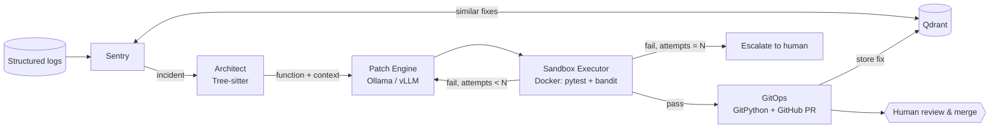

# Architecture

## Shared state (`SwarmState`)
`incident → similar_fixes → target → patch → test_result → attempts[] → pr → status`, plus an `events[]` audit trail
rendered by the dashboard.

## Key design decisions
1. **Deterministic localisation, generative repair.** The LLM only sees one function, not the whole repo - less
   hallucination, smaller prompts, runs on 7B models.
2. **Execution-grounded feedback loop.** Failure output from the sandbox is fed back into the next prompt
   (Reflexion / self-debug style), with rising temperature per attempt.
3. **Retrieval as memory, not as the answer.** Qdrant provides hints from past incidents; the patch is still
   generated and verified fresh (this is what separates it from passive RAG).
4. **Defence in depth.** AST validation → ephemeral copy → network-less container with dropped capabilities →
   bandit HIGH scan → human-reviewed PR.
5. **Learning loop.** Verified fixes are written back to Qdrant, so recurring incidents get resolved faster.
